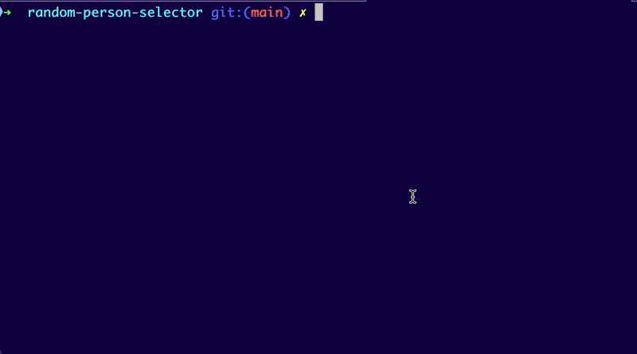

# random-person-selector
A simple tool to randomly and fairly select a name from a list

## Language

I figured this was a nice chance to have a play with [Go](https://go.dev/doc/tutorial/getting-started).

You'll need go installed: 

```bash
brew install go
```

and you can then check the success of this with: 

```bash
go version
```

## Setup

Before running, you will need to place a `.csv` file into the `/env` directory. 

Otherwise, you may get the error: 

```
open env/names.csv: no such file or directory
```

You can run this, from the route directory, to populate the `/env` directory
```bash
cp namestemplate.csv env/names.csv
```

This will need to follow the template provided in [namestemplate.csv](namestemplate.csv).

## Running

To run a go script, you can run: 

```bash
go run .
```

This relies the `go.mod` file to infer the entry point and what to run. 

Here's an example of it in action:



## Formatting

Go is quite nice for formatting. 

You can run: 

```bash
gofmt -w main.go
```

to format a file. The `-w` flag will write to the source file, otherwise it goes to STDOUT. 

You can also run: 

```bash
gofmt -s -w .
```

to recursively format the whole repo, if ran from the source root. 

## Testing

To run the tests, you just run: 

```bash
go test .
```

The naming convention is `*_test.go`. 